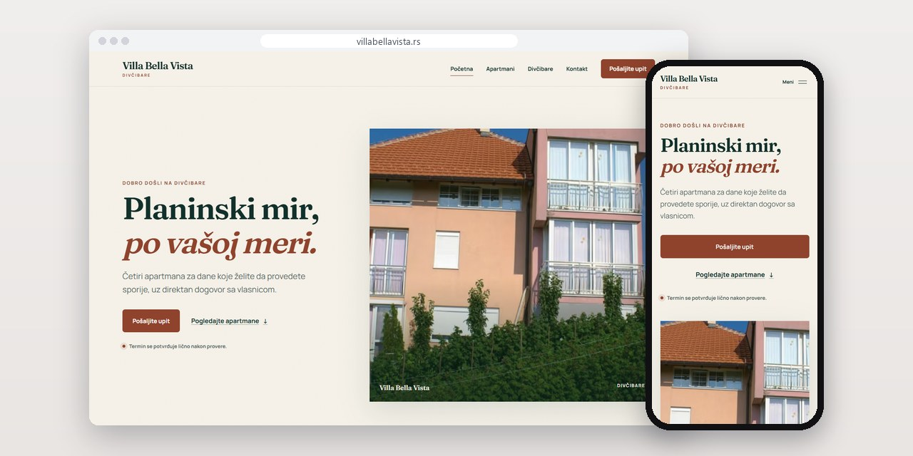
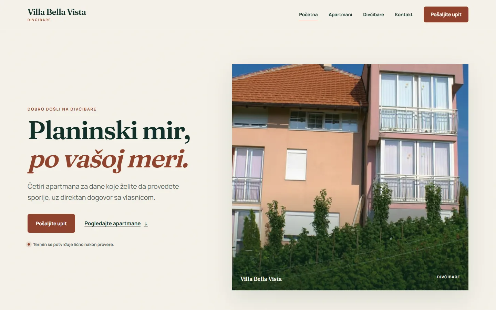
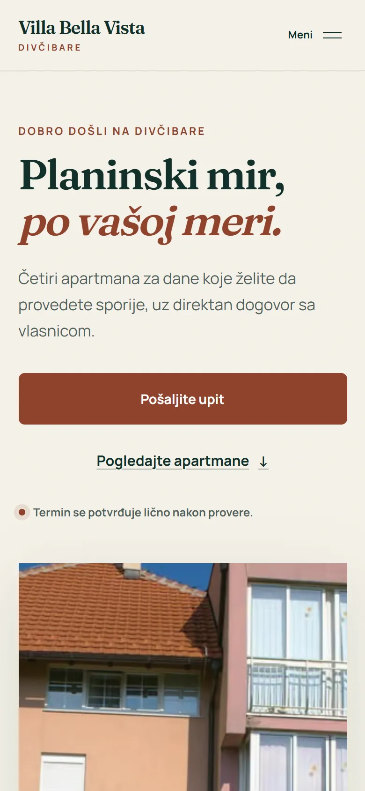
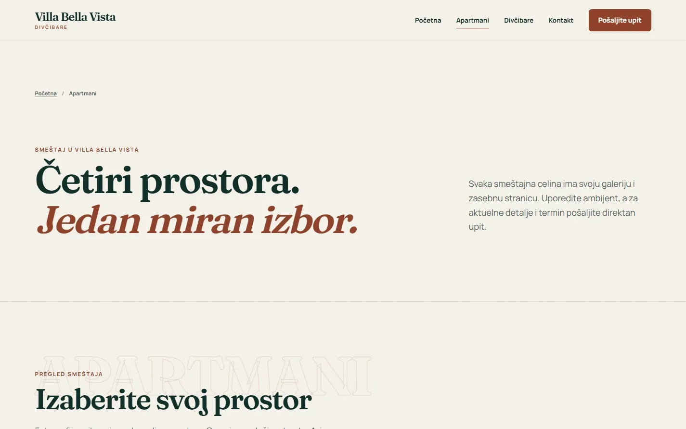
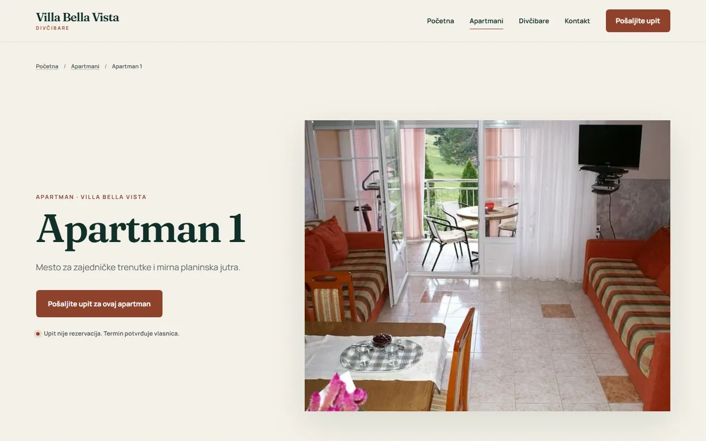

# Villa Bella Vista

Sajt za četiri apartmana na Divčibarama, gde svaki ima svoju galeriju, a svaki upit se sačuva pre nego što ode ijedan mejl.

**[villabellavista.rs](https://villabellavista.rs/)** · [Studija slučaja](https://svilenkovic.rs/radovi/villa-bella-vista) · [English](README.md)

> [!NOTE]
> Klijentski projekat. Izvorni kod pripada klijentu i čuva se u privatnom repozitorijumu. Ova stranica opisuje šta sam uradio i kako.

<table>
  <tr><td><b>Klijent</b></td><td>Villa Bella Vista</td></tr>
  <tr><td><b>Delatnost</b></td><td>Izdavanje apartmana</td></tr>
  <tr><td><b>Lokacija</b></td><td>Divčibare</td></tr>
  <tr><td><b>Vrsta</b></td><td>Sajt sa više strana</td></tr>
  <tr><td><b>Moj deo posla</b></td><td>Dizajn, izrada, SEO, hosting i održavanje</td></tr>
  <tr><td><b>Tehnologije</b></td><td>PHP 8.3, SQLite, PHPMailer, nginx, JSON-LD</td></tr>
</table>

## O projektu

Villa Bella Vista izdaje četiri apartmana na Divčibarama, a vlasnica svaki boravak potvrđuje lično, posle provere termina. Gost treba da uporedi četiri prostora, vidi dovoljno fotografija i pošalje datume, a da ne stekne utisak da je rezervacija već potvrđena. Sajt vodi tim redom, a konačan dogovor ostavlja vlasnici.

Upit se prvo upiše u SQLite bazu van javnog foldera, pa tek onda sajt pokušava da obavesti vlasnicu mejlom. Token uz svako slanje sprečava duplikate, a ograničenje broja zahteva štiti formu. Ako obaveštenje ne može odmah da ode, čeka u redu za ponovno slanje, pa nijedan gost ne mora dvaput da kuca isti upit.

## Šta sam uradio

- Strana za svaki apartman sa sopstvenim fotografijama i zajednička strana za poređenje sva četiri
- Forma za datume, broj gostiju, željeni apartman i kontakt, uz jasnu napomenu da upit nije rezervacija
- Galerije u AVIF, WebP i JPEG formatu u više širina, sa unapred poznatim merama, pa se raspored ne pomera
- Obaveštenja preko PHPMailer-a, iz reda koji ponavlja slanje dok ne uspe
- Vodič kroz Divčibare za goste koji planiraju dane na planini
- Automatski testovi za PHP kod

## Merenja

| | Performanse | Pristupačnost | Dobre prakse | SEO |
| :-- | :-: | :-: | :-: | :-: |
| Telefon | 99 | 100 | 100 | 100 |
| Desktop | 100 | 100 | 100 | 100 |

PageSpeed Insights, laboratorijsko merenje živog sajta, septembar 2026. Sigurnosna zaglavlja: 6 od 6. HTML validator: bez grešaka. axe provera pristupačnosti: bez prekršaja. Strukturisani podaci: `LodgingBusiness`.

## Snimci ekrana

<table>
  <tr>
    <td width="68%" valign="top"></td>
    <td width="32%" valign="top"></td>
  </tr>
</table>

Zajednička strana pomaže gostu da uporedi četiri smeštajne celine

Svaki apartman ima svoju stranu, galeriju i direktan put do upita

---

Izrada: [D. Svilenković](https://svilenkovic.rs).
